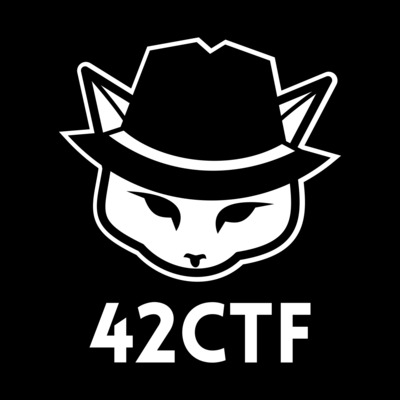

<p align="center">Hi there ! <br> 
  <samp>
    
    <br>I'm developer in DATA/IA Scientist and CTF Player from 
    <br>at <em>Ynov Informatique Ingésup</em> in <b>Paris, France !</b>
  </samp>
</p>

<hr>

<h3>🔍 Where to find me</h3>

<p align="center">
  <a href="https://github.com/GuillaumeDupuy" target="_blank">
    
  </a> 
  <a href="https://www.linkedin.com/in/guillaume-dupuy/" target="_blank">
    
  </a>
</p>

<hr>

<h3>💻 Things I code with</h3>

<p align="center">
  
  
  
  
  
  
  
  
  
  
  
  
  
  
  
  
</p>

<hr>

<h3>📤 Open projects</h3>

<table>
  <thead align="center">
    <tr>
      <td><b>📂 Projects</b></td>
      <td><b>⭐ Stars</b></td>
      <td><b>📚 Forks</b></td>
      <td><b>🛎 Issues</b></td>
      <td><b>📬 Pull requests</b></td>
      <td><b>🔨 Last Commit</b></td>
    </tr>
  </thead>
  <tbody>
    <tr>
      <td><a href="https://github.com/tot0p/Hello-World"><b>Hello-World</b></a></td>
      <td></td>
      <td></td>
      <td></td>
      <td></td>
      <td></img> </td>
    </tr>
  </tbody>
</table>

<h3>⏱ My latest posts</h3>
<ul>
  <li><a href="https://github.com/GuillaumeDupuy/CTF"><b>CTF Online</b></a><br/><i>Writing CTF solutions step by step</i></li>
  <li><a href="https://github.com/FeitanSama/mlutils"><b>Package Python ML</b></a><br/><i>Creating my own sklearn/pandas package</i></li>
  <li><a href="https://guillaumedupuy.fr/"><b>Site PortFolio</b></a><br/><i>Site CV </i></li>
  <li><a href="https://github.com/GuillaumeDupuy/Machine-Learning"><b>Projet Machine Learning</b></a><br/><i>Manual dataset analysis project (pre-processing, visualization, implementation of algorithms, optimization and comparison)</i></li>
  <li><a href="https://github.com/GuillaumeDupuy/Scraping_Python"><b>Web & Flask API & Database Scraping Project</b></a><br/><i>Project to scrape data from a website, convert it into a NoSQL database and use it in a Flask API and make a dashboard of this data in Streamlit</i></li>
  <li><a href="https://github.com/GuillaumeDupuy/Projet_NoSQL"><b>Projet NoSQL</b></a><br/><i>MongoDB API analysis project</i></li>
</ul>

<hr>

<h3>📊 My Stats Account</h3>


|Stats |Streak |Languages
|---|---|---|
|||
||

<details>
  <summary><h3>Here you can find some of my profils</h3></summary>
  <a href="https://www.hackerrank.com/GuillaumeDupuy"></a>
  <a href="https://ctflearn.com/user/Varius93"></a>
  <a href="https://www.42ctf.org/en/scoreboard/?page=3"></a>
  <a href="https://www.root-me.org/Varius-719910?lang=fr#0d377b7ef72617e4dfeae258abfcf389"></a>
  <a href="https://www.codingame.com/profile/d14c23439c339700804998724f41533d2814925"></a>
  <br><br>
</details>

<hr>

<h3>💻 Work Time of last 7 days</h3>

<!--WAKATIME-->
```text
⌚ Total time: 3 hrs 12 mins

💬 Languages:

Python         1 hr 49 mins 🟩🟩🟩🟩🟩🟨⬜⬜⬜⬜ 56.77 %
Markdown       1 hr 12 mins 🟩🟩🟩🟨⬜⬜⬜⬜⬜⬜ 37.81 %
Go             7 mins       🟨⬜⬜⬜⬜⬜⬜⬜⬜⬜ 3.71 %
Kotlin         1 min        🟨⬜⬜⬜⬜⬜⬜⬜⬜⬜ 0.71 %
ca65 assembler 0 secs       🟨⬜⬜⬜⬜⬜⬜⬜⬜⬜ 0.33 %
Assembly       0 secs       🟨⬜⬜⬜⬜⬜⬜⬜⬜⬜ 0.33 %
F#             0 secs       🟨⬜⬜⬜⬜⬜⬜⬜⬜⬜ 0.3 %
PHP            0 secs       🟨⬜⬜⬜⬜⬜⬜⬜⬜⬜ 0.02 %
Erlang         0 secs       🟨⬜⬜⬜⬜⬜⬜⬜⬜⬜ 0.01 %
Delphi         0 secs       ⬜⬜⬜⬜⬜⬜⬜⬜⬜⬜ 0.0 %

🔥 IDE:

VS Code 3 hrs 12 mins 🟩🟩🟩🟩🟩🟩🟩🟩🟩🟩 100.0 %

💻 OS:

Windows 3 hrs 12 mins 🟩🟩🟩🟩🟩🟩🟩🟩🟩🟩 100.0 %
```
<!--/WAKATIME-->

<hr>

<h3>✨ Projects starred by me</h3>

[My Awesome Stars](https://guillaumedupuy.github.io/my-awesome-stars/)

<hr>

<h3>🐍 Oh my god Snake eat all my work for the year</h3>


<hr>

<p align="center">Template By GuillaumeDupuy</p>
